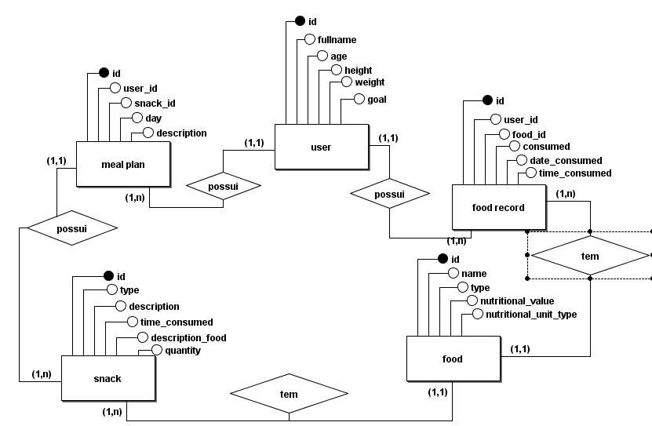
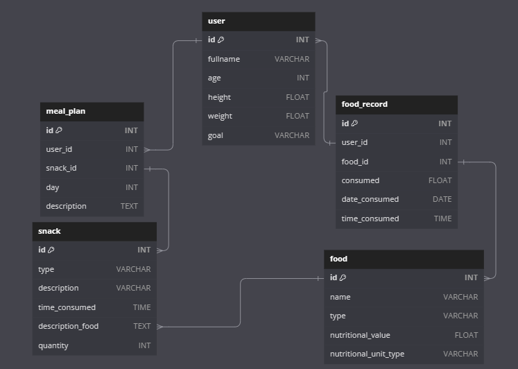

# Controle nutricional

## Problema
> Diante da correria da rotina, esquecemos de cuidar da nossa saúde alimentar, prejudicando nossa saúde e o nosso corpo.  

## Solução

> notei a necessidade de um banco de dados que possa simplificar o nosso cuidado alimentar para preservar a nossa saúde, abrangendo os diversos tipos de objetivos, desde a pessoa que é atleta, até a que busca perda de peso e hipertrofia ou simplismente um acompanhamento alimentar.

> Contato @contatoclaytonbahia@gmail.com 

> Agradecimento @Midssouza ; Oliviasmim.